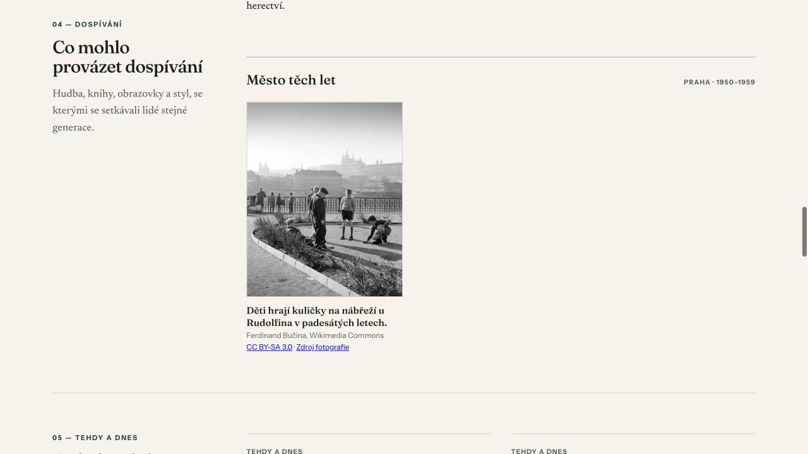
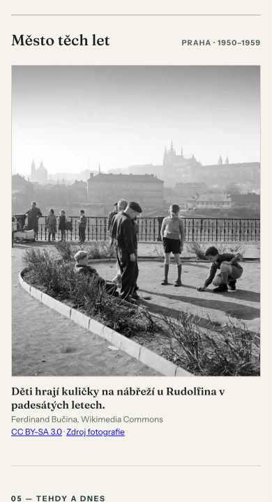
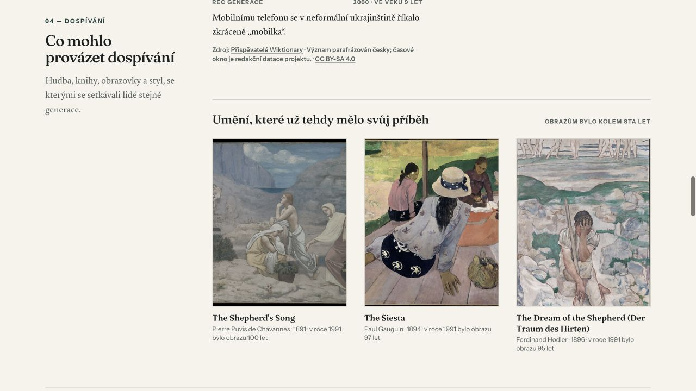

# P6 — browser a obrazová kontrola

Kontrola proběhla 30. července 2026 nad produkčním `vite preview` na Node 22.
Screenshoty jsou cílený důkaz nové plochy; nejde o produktové nebo historické
zdrojové obrázky.

## Praha 1953





Report s datem 12. 4. 1953 zobrazil:

- přesný řez Praha · 1950–1959;
- český alt a popisek;
- autora Ferdinand Bučina;
- viditelný odkaz CC BY-SA 3.0 a zdroj Wikimedia Commons;
- lazy obrázek se stejným originem.

Kontrolní reverse proxy zaznamenala pro P6 pouze:

```text
GET /assets/prague-DZZycFx_.js
GET /data/images/prague/1950/prague-1950-kulicky-u-rudolfina.webp
```

První požadavek je malý městský JSON chunk. WebP přišel až po posunu pásu do
viewportu. Žádný `cityImages` chunk jiného města se nenačetl.

## Charkov 1991



Year-only report správně zobrazil historické místo „Charkov, Ukrajinská SSR /
Ukrajina“, výzvu k doplnění celého data pro oblohu a původní výtvarný fallback.
Proxy zaznamenala charkovský městský chunk:

```text
GET /assets/kharkiv-Yb6xsqbH.js
```

Protože sada neobsahuje přesný bezpečný snímek z devadesátých let, neproběhl
žádný požadavek na `/data/images/`.

## Responzivita a přístupnost

Landing i hotový pražský report byly vykresleny v iframech s reálným viewportem
320, 375, 390, 768, 1024, 1280 a 1440 px. Ve všech případech byly hodnoty
`scrollWidth` a `clientWidth` shodné; vodorovný overflow nevznikl. Mobilní pás
zachoval popisek i odkazy bez ořezu. Klávesnicový fokus měl 3px korálový outline.

Sémantický snapshot potvrdil nadpis úrovně 3, obrázkový alt, popisek, licenci a
zdroj jako skutečné odkazy. V konzoli nebyla chyba ani varování; lokální preview
vydalo pouze informační log o nedostupném Vercel Analytics skriptu.

## Exportní regrese

Z téhož pražského reportu byl skutečně stažen sdílecí PNG
`tehdejsi-svet-fact-landscape` o rozměru 1200×630 px a čtyřstránkové A4 PDF o
velikosti 193 151 B. PNG bylo otevřené v plném rozlišení a všechny čtyři strany
PDF vyrenderované přes Poppler při 120 DPI. Text, diakritika, obloha, page
breaks, citlivý kontext i patičky byly čitelné. Ani jeden export neobsahoval
městskou fotografii.
